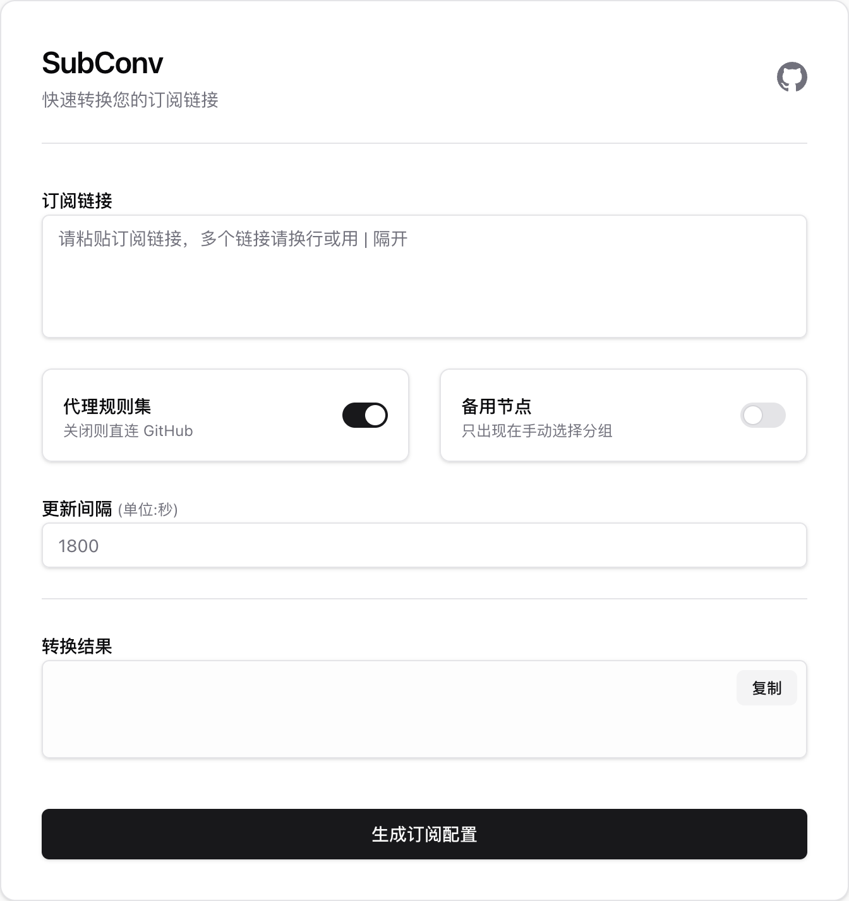

# SubConv — Subscription Converter

English | [中文](README_CN.md)

 

A self-hosted subscription converter that transforms V2Ray / SS / SSR links or Clash configs into a [mihomo](https://github.com/MetaCubeX/mihomo)-compatible Clash config with auto-updating proxy-providers and rule-providers.

## Screenshot



## Features

- Accepts V2Ray base64 links, share links, or existing Clash configs as input
- Built-in Web UI for generating the converted subscription URL
- Rule-based routing (ACL-style), auto-updates via rule-provider
- Proxy-provider for node auto-update without restarting the client
- Proxies rule-provider requests through the server to avoid GitHub access failures
- Multiple airport (subscription) support — merge into one config
- Traffic remaining / total display (requires airport and client both support `subscription-userinfo` header)
- `/provider` API: converts a subscription into a standalone proxy-provider YAML
- Fully configurable via `config.yaml`

## Deploy

### Docker (recommended)

```bash
# 1. Edit the config as needed
vim config.yaml

# 2. Start
docker compose up -d
```

The service listens on port `8080` by default. Edit `docker-compose.yml` to change it.

```yaml
# docker-compose.yml
services:
  subconv:
    image: ghcr.io/bowencool/subconv:latest
    restart: unless-stopped
    ports:
      - "8080:8080"
    volumes:
      - ./config.yaml:/app/config.yaml
```

### Node.js

Requires Node.js 22+.

```bash
npm install
npm run build
npm start          # PORT defaults to 8080
```

Set environment variables as needed:

| Variable | Default | Description |
|---|---|---|
| `PORT` | `8080` | Listening port |
| `HOST` | `0.0.0.0` | Listening host |
| `DISALLOW_ROBOTS` | — | Set to `true` to block search engine crawlers |

## API

### `GET /sub` — Convert subscription

| Parameter | Required | Description |
|---|---|---|
| `url` | ✅ | Subscription URL(s) or share links, separated by `\|` or newline |
| `urlstandby` | — | Standby nodes (same format), only appear in manual-select groups |
| `interval` | — | Rule/node update interval in seconds (default: `1800`) |
| `npr` | — | Set `1` to fetch rule-providers directly from GitHub instead of proxying |
| `short` | — | Set `1` to output a short proxy-only config |

**Example:**
```
https://your-domain/sub?url=https%3A%2F%2Fexample.com%2Fsub
```

### `GET /provider` — Subscription to proxy-provider

Converts a raw subscription into a Clash proxy-provider YAML, useful for referencing nodes in a custom config.

```
https://your-domain/provider?url=<subscription_url>
```

### `GET /proxy` — Rule-provider proxy pass

Proxies a URL through the server, used internally to fetch rule lists from GitHub when `npr` is not set.

## Configuration (`config.yaml`)

The config file controls the Clash output. Key sections:

```yaml
# Clash HEAD block — merged into the output config as-is
HEAD:
  mixed-port: 7890
  allow-lan: true
  # ... other Clash options

# URL used for latency testing
TEST_URL: https://www.gstatic.com/generate_204

# Rule sets — each entry is [proxy_group, rule_list_url]
RULESET:
  - ["🌍 Proxy", "https://cdn.jsdelivr.net/gh/bowencool/SubConv@main/rules/bowen-proxy.list"]
  - ["DIRECT",   "https://cdn.jsdelivr.net/gh/bowencool/SubConv@main/rules/bowen-direct.list"]
  # ... more rules
```

## License

[MPL-2.0](LICENSE)
